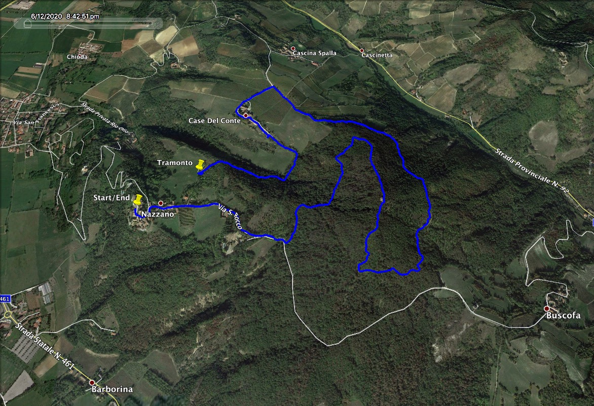

```{r global_options, message=FALSE, warning=FALSE, include=FALSE, paged.print=TRUE}
knitr::opts_chunk$set(
  tidy = FALSE,
  echo = TRUE,
  cache = FALSE,
  # results='asis',
  message = FALSE,
  warning = FALSE,
  fig.show = "asis",
  fig.align = "center",
  fig.width = 8, fig.height = 8
)

if (!require("pacman")) install.packages("pacman")
p_load(here, fs,
       rio, readxl, # x importare da STATA
       tidyr, lubridate, dplyr, stringr, skimr, 
       purrr, 
       janitor,# dataset manipulation
       paint,# tribble, # x fare tabelle a mano
       ggplot2, # grafici
       DT,  pander,  kableExtra, gt , gtExtras# tabelle html
       
)
## Theme for graphs
# cleanup <- theme(
#   panel.grid.major = element_blank(),
#   panel.grid.minor = element_blank(),
#   panel.background = element_blank(),
#   axis.line = element_line(colour = "black"),
#   legend.key = element_rect(fill = "white"),
#   text = element_text(size = 15)
# )
```


```{r gite_data}
# prep data x Kable 
gite <- as.data.frame(readxl::read_excel(here::here( "reference","Gite.xlsx")) )%>% 
  janitor::clean_names()

# fs::path_abs("./reference/AnelloNazzano.jpg" )
# fs::path_abs("./reference/AnelloMontalto.png" )

# prep data x gt 
gite2 <- tibble(
    livello         = c("T", "T", NA, NA),
    catena          = c("bassa Valle Staffora (PV)", "Montalto Pavese (PV)", NA, NA),
    citta_provincia = c("Nazzano (PV)", "Montalto Pavese (PV)", NA, NA),
    nome            = c("Anello di Nazzano", "Anello di Montalto", NA, NA),
    rif_partenza    = c("Parcheggio Nazzano (vicino ristorante)", "Madonna del vento", NA, NA),
    rif_arrivo      = c("(giro ad anello)", "(giro ad anello)", NA, NA),
    durata          = c("2:13:59",  "2:15:00",  NA, NA),
    dislivello      = c("215", "310", NA, NA),
    note            = c(NA,NA,NA, NA),
    data            = c("12 Giu 2020", "12 Giu 2023",  NA, NA),
    link_web        = c("https://www.avmtrekking.com/anello-di-nazzano-serale",
                        "https://www.komoot.com/it-it/tour/1093134865", NA, NA), 
    link_pic       = c("/Users/luisamimmi/Github/gite/reference/AnelloNazzano.jpg", 
                       "/Users/luisamimmi/Github/gite/reference/AnelloMontalto.png", NA, NA ),
    persona_di_rif  = c("Pierre Greppi", NA, NA, NA)
) 

```

# gite_gt_purr


<!-- [Rif {purrr}+{htmltools}](https://community.rstudio.com/t/create-interactive-links-in-gt-table-in-rmarkdown/70266/2) -->
<!-- [Rif](https://stackoverflow.com/questions/3139811/how-to-link-an-image-and-target-a-new-window) -->

```{r gite_gt_purr}

# --- Function transforming COLUMN WITH LINK (PIC) 
f_make_piclink = function(mysrc) {
  paste0(
# Create `img` element --> set `src` attribute --> give `href` property to anchor      
      # set the `target` attribute on the anchor element and set it to _blank. (open in new tab)
      '<a href="',mysrc,'" target="_blank"> </a>')
}
f_make_piclink ("/Users/luisamimmi/Github/gite/reference/AnelloNazzano.jpg") 

# f_make_piclink2 = function(mysrc) {
#   paste0('<a href="',mysrc,
#         '" alt="" target="_blank"> </a>')
# }
# 
# f_make_piclink2 ("/Users/luisamimmi/Github/gite/reference/AnelloNazzano.jpg") 

# <a href="Users/luisamimmi/Github/gite/reference/AnelloNazzano.jpg" target="_blank">
#   </a>
# 
# 
# https://stackoverflow.com/questions/3139811/how-to-link-an-image-and-target-a-new-window


# using html
gite2 %>% 
    select(-note, -persona_di_rif) %>% 
    mutate(
# ---- COLUMN WITH LINK   {purrr}+{htmltools}     
        # wrap <a> around 
        # <a href='https://www.avmtrekking.com/anello-di-nazzano-serale'> Programma </a>
        link_web = map(link_web, ~ htmltools::a(href = .x,  "web")),
        # gt::html tells gt to deal with the text as html content.
        link_web = map(link_web, ~ gt::html(as.character(.x)))) %>%

gt()  %>% 
# ---- COLUMN WITH LINK (PIC)       
    # -- SOL b) OK 
    # set colum format  4 PIC      
    gt::fmt (columns = 'link_pic', fns = f_make_piclink) 

```


<!-- # gite_gt_fn -->

```{r gite_gt_fn , eval=FALSE, include=FALSE}

# using ad hoc fns

# ----- FUNC 1/2
# <a href='https://www.avmtrekking.com/anello-di-nazzano-serale'> Programma </a>
f_make_hyperlink = function(myurl, mytext = "web") {
  paste('<a href="',myurl,'">',mytext,'</a>')
}
#f_make_hyperlink("https://www.avmtrekking.com/anello-di-nazzano-serale")

# ----- FUNC 2/2
# 
f_make_piclink = function(mysrc, mytext = "pic") {
  paste0('')
}
#f_make_piclink ("/Users/luisamimmi/Github/gite/reference/AnelloNazzano.jpg")

gite2 %>%
gt() %>%
  # set colum format  4 WEB      
  gt::fmt (
    columns = 'link_web',
    fns = f_make_hyperlink
  ) %>%
  # set colum format  4 PIC      
     gt::fmt (
    columns = 'link_pic',
    fns = f_make_piclink
  ) 


```

```{r gite_kable, eval=FALSE, include=FALSE}
# ---- 1) using kableExtra
gite %>% 
  #select(-phone, -address, -country, -title, -mef_ref_person) %>% 
kable(., align = "l", escape = F#, format = "latex"
      ) %>%
  kable_styling(bootstrap_options = "striped", 
                full_width = F, # x non occupare tutta la larghezza
                position = "left") %>%
  column_spec(column = 1, bold = T, color = "white", background = "#D7261E") %>%
  column_spec(column = 3, bold = T, color = "blue") %>%
  #scroll_box(width = "1000px"
             #, height = "500px"
             #) %>%
  footnote(., footnote_as_chunk = F,
             escape = T,
           general = "Clarifications:",
           #number = c("Footnote 1; ", "Footnote 2; "),
           alphabet = c("**T** - Turistico: Passeggiata su strade sterrate e ampi sentieri con pendenze modeste, dislivelli inferiori a 300 m e sviluppo inferiore a 10 km. **E** - Escursionistico: Escursione semplice ma che richiede una buona forma fisica senza dover essere degli atleti. Percorsi su sterrate, ampi sentieri a scarsa pendenza ma anche sentieri di montagna più articolati e con pendenze leggermente maggiori. Dislivelli compresi fra 300 e 600 m. Sviluppo tra 10 e 15 km. **EE** - Escursionisti Esperti: Escursione per i più esperti e allenati. Rimangono escursioni con difficoltà tecniche comunque mai eccessive (eventuali brevi tratti esposti con catene, sentieri ripidi, tracce di sentiero, brevi tratti di roccette di primo grado, eventuale attraversamento di nevai) ma occorre avere una buona esperienza escursionistica e un buon allenamento. Pendenze a tratti sostenute. Dislivelli anche oltre i 600 m. Sviluppo anche oltre i 15 km. **EEA** - Escursionisti Esperti Attrezzati: Percorso attrezzato che richiede l'utilizzo dell'attrezzatura per via ferrata. **EAI** - Escursionisti in Ambiente Innevato: Itinerario in ambiente innevato che richiede l'uso di racchette da neve, ma comunque su terreno senza grandi pendenze, con percorsi evidenti, e senza tratti esposti."),
           #symbol = c("Footnote Symbol 1; ", "Footnote Symbol 2")
           )


# ---- 2) using DT::datatable
# gite %>% 
#    select(-phone, -address, -country, -title, -mef_ref_person) %>% 
#    datatable(., 
#          filter = 'top', 
#          options = list(pageLength = 50, autoWidth = TRUE, 
#                         escape = TRUE # argument so that it doesn't escape the HTML code.
#          )) %>%
#    formatStyle('name',  color = 'blue', backgroundColor = 'orange', fontWeight = 'bold')

# # ---- 3) using pander::pandoc.table
# caption <- "Description of indexes of NGO barriers {#tbl:ngo-barriers-index}"
# 
# gite.table <- pandoc.table.return(gite, keep.line.breaks = TRUE,
# 											  round = 2,
# 											  big.mark = ",",
# 											  justify = "lllllllllllll", # OKKIO AL # DI COLONNE
# 											  caption = caption, style = "multiline",
# 											  split.table = Inf
#                                        )
# cat(gite.table)
```

```{r SBAGLIATO, eval=FALSE, include=FALSE}
gite$link_cv_2 <- paste0("<a href='", 
                             gite$link_cv, #url
                             "' target='_blank'>", 
                             gite$link_cv, #text
                             "</a>")


for(i in 1:nrow(gite)){
    #deal with links
    if(!is.na(gite$link_cv[i])){
        gite$link_cv = paste0("[Link](", gite$link_cv[i], ")")} else {gite$link_cv = ""}
}

# print(gite)


```
